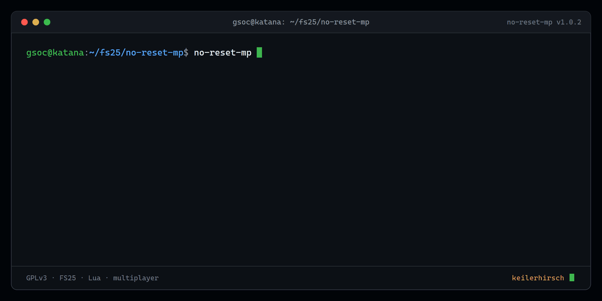

<div align="center">
  <picture>
    <source media="(prefers-color-scheme: dark)" srcset="docs/logo-dark.svg">
    
  </picture>
</div>

> [!IMPORTANT]
> Enjoying the mod? You can support development on **[Ko-fi](https://ko-fi.com/keilerhirsch)** ☕ — please mention *No-Reset MP* so I know what to keep building.

<p align="center"></p>

Hardcore multiplayer realism for **Farming Simulator 25**: removes the free,
player-triggered *"reset vehicle to shop"* option in multiplayer. A stuck,
flipped or misplaced vehicle can no longer be teleported home for free — you
have to drive it back yourself (or, in a planned later version, pay for a tow).

**Singleplayer is left completely untouched.**

## What it does — and what it deliberately does *not* touch

| Behaviour | With this mod |
|-----------|---------------|
| Player "reset to shop" (map / garage), multiplayer | **Blocked** |
| Player "reset to shop", singleplayer | Unchanged |
| Engine out-of-world safety net (vehicle falls through terrain / leaves the world) | **Still works** — vehicles are still rescued automatically |
| Vehicle wear, physics, anything else | Untouched |

## How it works (verified against the FS25 base source)

The player reset is gated by `Vehicle:getCanBeReset()`
(`dataS/scripts/vehicles/Vehicle.lua:4183`). The base game itself uses exactly
this flag to make vehicles non-resettable (`ProtectedBundleVehicle` sets
`self.canBeReset = false`).

This mod overwrites `Vehicle.getCanBeReset` so it returns `false` in
multiplayer. Because the `Attachable` specialization chains through
`superFunc`, the block also covers attached implements; `Locomotive`,
`Pallet` and `Rideable` are already non-resettable in the base game.

Crucially, the engine's out-of-world safety net
(`Vehicle.lua` ~1928–1963) calls `self:reset(true, nil, true)` **directly**
and does **not** consult `getCanBeReset()`. So it keeps working and no vehicle
ever gets bricked. The mod never touches `Vehicle:reset` itself.

There is no vehicle-reset network event and no in-vehicle "recover" action in
the base game, so this single gate is the complete choke point — no separate
server-side event needs to be denied.

## Install

1. Copy `FS25_NoResetMP.zip` into your `mods/` folder.
2. On a **dedicated server**, add it to the server's mod list — it is then
   forced onto every client automatically.

No configuration required. It just works.

## Multiplayer note

`getCanBeReset()` runs on the server and on every client (the server forces the
mod onto clients), so the reset option is gone everywhere. Singleplayer sessions
never trigger the block.

## Roadmap

- **v1 (this):** Hardcore — block every player reset path in multiplayer.
- **v2 (planned):** Paid tow as a legal alternative to driving home.
- **v3 (planned):** "Tow to workshop" mechanic (tied to the EnhancedVehicle +
  ADS fusion project).

## Building the zip

```
./build.sh
```

This zips the individual mod files so `modDesc.xml` sits at the **root** of the
archive (required by FS25). Do **not** zip the containing folder
(`zip -r out.zip FS25_NoResetMP`) — that nests everything under
`FS25_NoResetMP/` and the game fails with *"Failed to open modDesc.xml"*.

Only `modDesc.xml`, `scripts/`, the icon and `LICENSE` go into the shipped mod;
tests and dev files are excluded.

## Testing

The pure decision logic is covered by a busted spec:

```
busted        # requires a Lua 5.1 / LuaJIT environment + busted
luacheck .    # static analysis (config in .luacheckrc)
```

## License

**GPLv3** — free software. Forks and redistribution are welcome; you **must keep the author attribution (KeilerHirsch)** and the same license. See [LICENSE](LICENSE).
